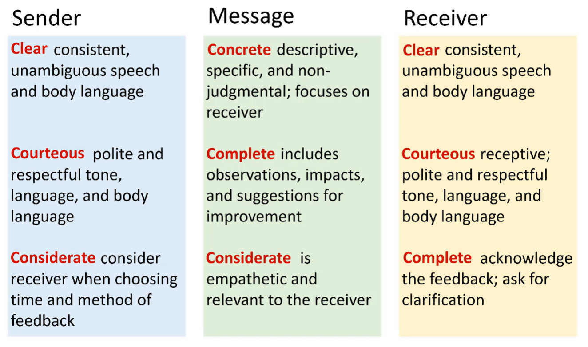

# APSC 101

## Week 1 Video 1: Safety and Hand Tools

* Learning goals
  * Describe basic safety protocols for working with handtools
  * Name all of the tools used in Module 5, and describe the function and operation of each
  * Identify which tools were used to create various features in components
* Studio expectations
  * PPE including closed toe shoes, long pants and safety goggles
  * Safety goggles
    * Worn at ALL TIMES. Eyeglasses are not alternatives
    * Encouraged to bring our own
  * Injuries
    * Minor injury: notify instructor. Get bandage if necessary. 
    * Serious injury: notify instructor, call 911 and stay on line, have someone wait outside EDC for paramedics
* Hand tools
  * Aviation Snips or Shears
    * Two types that are mirror images
    * Used like scissors to cut sheet metal
    * Do **not** cut wires
    * Often, one tool is easier to use in a particular direction
    * Curved cuts (waves, circles) are also possible
  * Pliers
    * Used to cut wires
  * Seamer (sheet metal pliers)
    * Used to make a straight fold in sheet metal
  * Nibbler
    * Insert sheet metal to "nibble" a small piece from the sheet
    * Nibbles out straight lines and slots
  * Hole Punch
    * For most people, easier to use upside down
    * Mark holes with cross hairs
    * Locate position and punch hole
    * If sheet metal becomes stuck, rapidly pull apart handles
  * Pop Riveter (Riveting tool)
    * Use the first piece to transfer holes to the second piece
    * Used to hold 2 sheets together **permanently**
    * Push the pop rivet back into the riveting tool after every squeeze
    * Pull out the mandrel (long pin) before each use

## Week 2 Video 1: Managing Risk

* Learning goals
  * Define the term "risk"
  * Describe the factors that determine risk
  * Classify risks by common sources and categories
  * Explain what a risk matrix is and how it is used
  * Describe the risk management procedure
* Risk = Severity * Likelihood. Risk is the possibility of injury, loss, or damage
* Sources of risk
  * Preventable risks: within team control
  * Strategic risks: risk with possibility of reward
  * External: outside of control, but must be considered
* Risk Categories

* Risk classification
  * Risk source vs risk category

* Risk management strategies
  * Avoid (best but often unable)
  * Mitigate (minimize likelihood or severity)
  * Transfer (pass risk to others, i.e. insurance)
  * Accept to live with consequences

* Safety is **paramount** 
* Risk matrix
  * Severity (1 to 5) and likelihood (1 to 5). Risk is the product (from 1 to 25)
* Procedure: Identify risk -> risk analysis -> is risk acceptable? (risk matrix). Either accept, avoid/transfer, or mitigate

## Week 2 Video 2: Team Development

* Learning Goals
  * Describe the different stages of typical team development (Tuckman model)
  * Identify key features of effective engineering teams
  * Describe the benefits and costs of conflict on a team
  * Identify appropriate conflict management strategies to use in various team situations

* Tuckman's Stages of Team Development
  * Completion of tasks vs team relationships
  * Forming: politeness, uncertainty, optimism. Lack of clear goals, people try to help. Team members work as individuals
  * Storming: members feel more willing to speak. Leads to conflict, tension, stress. Quality and quantity of work diminishes 
  * Norming: consensus built, roles established, standards set
    * Updated model: good and bad norming. Bad norming is where bad norms like skipping meetings comes to be accepted
  * Performing: successful performance, openness, trust established
* Transition between stages
  * Conflict: always present, but is out in the open and more intense during storming
  * Forming -> storming: time spent building team relations, leadership established
  * Storming -> norming: open communication, desire to get better as a team
  * Norming -> performing: environment where people feel safe to speak their minds. Value on the team over the individual
* Norms
  * Bad team norm if a teammate doesn't show up and that is just accepted
* Conflict management styles
  * Assertiveness (achieving own needs) and cooperativeness (achieve other's needs)

* Suited to different situations
* Best to be flexible and adaptable

## Week 3 Video 1: Isometric and Orthographic Projection

* Learning goals
  * Describe what is meant by "projection" in the context of engineering drawings
  * Explain how isometric and orthographic projection drawings are produced, and the pros and cons of each
  * Explain why hidden lines are used in orthographic drawings
  * Interpret isometric and orthographic drawings
* Projection: view of 3D object on 2D plane

* Isometric Projection
  * Oblique view from one corner
  * Properties
    * Vertical lines are vertical
    * Horizontal axes rise at 30 degrees to horizontal on the page
    * Equal distant along axes have equal distance on the page
    * Parallel lines are parallel (different from perspective)
      * In perspective, parallel lines converge to vanishing point
  * Sketching Isometric Projections
    * Lightly sketch enclosing box(es)
    * Draw shape
    * Erase box
* Orthographic Projection
  * Front, End, Top, Other End, Bottom, Back views
  * Typically use three: Front, Top, and one of the Ends
  * Hidden lines: dashed lines that reveal features on the inside or back of the part
  * Centerlines (long short dashes): used to identify center of circles and axes of cylinders

## Week 3 Video 2: Engineering Drawings - Layout and Dimensions

* Learning goals
  * Describe what is meant by "Third Angle Projection" and be able to arrange orthographic views in accordance with it
  * Describe what a "title block" is and how it is used on an engineering drawing
  * Describe the standards of dimensioning engineering drawings and identify dimensioning errors
* Third Angle Projection (used in North America)
  * Unfold three standard orthographic views
  * Front view and top view align, front view and end view align
  * Third angle projection symbol: 
* Title Blocks
  * Border: numbers and letter provide a way to reference regions of the drawing
  * Third angle projection symbol is included in the title block
  * Information included
    * Drawing name
    * Drawing number
    * Revision number/letter
    * Drawing scale
    * Who prepared/checked drawing
    * Detail on units and precision of dimensions
* Dimensions
  * Dimensions indicate length/size
    * Dimension (# of units)
    * Dimension line with arrows on both sides
    * Extension line (comes close to object but does not touch)
  * Guidelines
    * Draw dimensions **outside** of the view of the part
    * Do not show **redundant** dimensions
    * When possible, place dimensions between views
    * Dimension the view that most clearly shows the feature
    * Extension lines may cross, dimension lines may not

## Week 4 Video 1: Giving and Receiving Feedback

* Learning goals
  * Recall three types of feedback in the workplace (from module 4)
  * Describe how the 7 Cs of communication relate to face-to-face feedback
  * Describe the 3x3 Model of Feedback and how it applies to face-to-face feedback
* Types of feedback 
  * Appreciation: appreciation for job done
  * Coaching: help someone improve
  * Evaluation: rate someone against standards
* Clear, Correct, Concise, Concrete, Complete, Courteous, Considerate
* Sender, Receiver. Message, Response
* 3x3 Model
  * Message
    * Concrete (descriptive, specific, non-judgmental)
    * Complete (details but also suggestions and impacts)
    * Considerate (empathetic and relevant)
  * Sender
    * Clear (consistent, unambiguous language)
    * Courteous (sincere and polite)
    * Considerate (choose time and method of delivering feedback)
  * Receiver
    * Clear (consistent, unambiguous language)
    * Courteous (receptive, respectful)
    * Complete (acknowledge feedback and request clarification as appropriate)

## Week 4 Video 2: Top Performing Teams

* Learning Goals
  * Describe the characteristics of relationships on top-performing teams
  * Describe what equity, diversity, and inclusion (EDI) are and how they impact teams
  * Define implicit bias, stereotype threat, microaggressions, and psychological safety
  * Describe the origins and consequences of bias
  * Explain how psychological safety relates to team performance
* Equity, Diversity, and Inclusion
  * Equity: making sure everyone has similar opportunities to success
    * Different from equality
  * Diversity: differences between background and experiences
    * Race, gender, and race
    * Political belief, orientation, etc
    * Benefits of diversity: more creative solutions, cultivate stronger relationships -> better performance of individual, teams, companies, and companies with diverse leadership outperform those without
  * Inclusion: address inequities, support diverse perspectives, integrate everyone's contributions
* Bias
  * Implicit bias
    * Shaped through media, environment, culture, people around us, and our lives
    * Subconscious attitudes and stereotypes
    * Everyone has implicit biases
  * Microaggressions
    * Brief and common-place statements that are hostile towards some groups
    * Seemingly small statements that reinforce stereotypes
* Stereotype threat
  * People worrying about confirming stereotype
  * Increases anxiety and self-doubt
* Effective teams
  * Dependability
  * Structure & clarity
  * Meaning (work is fulfilling)
  * Impact (team members feel their work matters)
  * **Psychological Safety** (team members feel free to take risks and express themselves)
* Allyship
  * Taking actions to support individuals from underrepresented groups

## Week 5 Video 1: Module 6 Case Study Introduction

* Learning goals
  * Describe the engineering design stages that can be informed by sustainability
  * Explain the challenges related to providing drinking water in Canada
  * Describe the overall objective of the Module 6 case study
* Case study
  * Application for funding for a water treatment system for a fictitious small, remote community in BC
  * Written proposal (Expression of Interest, EOI)
  * Formal presentation
  * Costs committed in the early stages affect actual costs in the later stages
    * Sustainability should be considered from the very beginning
  * Module 6: focus on study and clarify problem, generate and identity solution
    * Stage 0,1,2,3
  * Module 7: develop and test solution (water treatment system)
    * Stage 4
* Same Drinking Water XPrize
  * Goal: to provide access to safe drinking water to everyone, all the time
  * Including developed nations (for example, Flint Michigan)

* Water stress
  * Lack of quantity/quality of water
* Boil water advisory: boil water, do not drink directly (due to concern with water treatment)
  * Issued when safety of water cannot be guaranteed
  * Small communities tend to get more boil water advisory (~80% for communities with <500 ppl)
  * Disproportionate water advisories for first nations communities 
* Challenges for small & remote systems
  * Difficult to supply chemicals and parts
  * Challenging to retaining skilled operators
  * Source water quality is often lower
  * Economies of scale (costs more per volume to treat water in small systems)

## Week 5 Video 2: Water Treatment Systems

* Learning goals
  * Explain what is meant by "centralized", "semi-decentralized", and "decentralized" water treatment systems
  * List the advantages and disadvantages of each system
  * Describe the centralized and decentralized solutions for the Module 6 case study
* Centralized Water Treatment Systems
  * Found in large cities
  * Single large water treatment plant provides water for large number of people
  * Waste water is brought to one place and treated at waste-water treatment plants
  * Advantages
    * Easier to maintain
    * Easier to monitor treatment process
    * Lower cost/volume of water treated
  * Disadvantages
    * Large infrastructure required
    * Vancouver: 1500km of water pipe, 3000km of sewer pipe
    * Difficult to adjust capacity (not well suited for growth)
* Semi-decentralized
  * Larger number of treatment plants
  * Treatment is still centralized locally
* Decentralized
  * Water treatment at each building (point of entry system)
  * Each business/household (point of use system)

* Module 6
  * Centralized: treated elsewhere
    * Water is treated, and then transported using boat (in bulk or smaller containers)
  * Decentralized/semi decentralized: treated on island
    * Semi decentralized
      * Single source/treatment facility for entire community
    * Decentralized
      * Treatment at each water use facility (i.e. household)

## Van Anda Interview notes

* 2015: small community Van Anda
* First year that they've worried about it
* Climate change
  * Flooding (has not happened in 50+ years)
  * Drought (3 months of no rainfall)
    * Lake gone down 5 feet (evaporation)
* Dry summers, lake level dropped
  * Always had enough water
  * Now: making community aware of water usage
* Water
  * Ferries from Vancouver, or flown in (for high cost)
* No alternate source 
  * If the lake is compromised, no options
  * Plan B: trucking in water, not much of a plan
* Lack of alternate source
  * Only piped to one lake
  * Limited number of lakes
* Chlorine
  * $16000 for chlorine
  * Would be best if there was another way not using chlorine
* More willingness to talk about water
* Difficult to talk to representatives of industry
  * Notion that: industry is more important than environment
* Front end load
  * Expensive upfront, minimal cost later on
  * Bad to hit with costs constantly 
* Water
  * Drinkable
  * Simple, easy to run
* Putting in a well
  * Because of old mine shafts, not clean water
  * There's cost too (100k to just explore for water)
* Catch water
  * Not enough
* Small systems tend to not be engineered properly
* If money is spent, we want a good system that will last
* Some people are living off the grid, a system that needs power would be an issue to some people

## Week 6 Video 1: Life Cycle

* Learning goals
  * List the key goals of assessing for sustainability
  * Describe the main concepts considered in Life Cycle Thinking and list the associated Life Cycle stages
  * Describe how Life Cycle Thinking and Systems Thinking relate to assessing for sustainbility
* Sustainability: wellbeing of environment, society, economy
  * Not about tradeoffs between the dimensions

* Life cycle thinking

* Systems thinking
  * Considers how product interacts with other elements in a system
* Sustainability is a property of a system
  * Focus on creating positive contributions, not mitigating adverse effects

## Week 6 Video 2: LCA & SLCA

* Learning goals
  * Explain how to conduct both Life Cycle Assessments (LCA) and Streamlined Life Cycle Assessments (SLCA)
  * Describe the advantages and disadvantages of LCAs and SLCAs, and where each might be used in the design process
  * Define the terms "functional unit" and "environmentally responsible product rating"
* LCA
  * Used by many companies in industry
  * Rigorous and structure process
  * ISO 46 pages, 26 requirements
  * Stages
    * Goal definition and scope
      * System boundary: aspects of product and lifecycle stages that are considered
      * Look at material and energy input/output
      * Functional unit: measure of performance for use as a reference unit
    * Inventory analysis
      * Detailed process of identifying material and energy input/output of system boundary
    * Impact assessment
      * Use environmental impact metrics
    * Interpretation
      * Distill impacts
  * Challenges
    * Detailed knowledge is required
    * Impacts must be quantified
    * Focus is primarily on environmental impacts
  * Typically only available late in the design process, when all decisions have been made
* SLCA
  * Qualitatively assess criteria
  * Tabulate in SLCA matrix
  * Sum to determine rating
  * Benefits
    * Simple, fast, and inexpensive
    * Qualitative (more suitable for difficult to quantify criteria)
    * Suitable for use early in design process
    * Captures 80% of environmental issues identified by full LCA

## Week 7 Video 1: Appropriate Technology

* Learning goals
  * Explain the concept of appropriate technology
  * List common features of appropriate technology
  * Explain the importance of the community when considering appropriate technology
* Appropriate technology
  * Design solution considers the key stakeholders across all life cycle stages for that solution
  * Solution is appropriate for the context
* Example: clean water in Africa
  * Play pump: intended for children to use by spinning. tens of millions funded
  * In reality: novelty wears off and children sit on it. 
  * Sometimes it is too cold/hot for operating the play pump
  * The tech is difficult to maintain by locals
  * Grown women end up using the play pump, which is not appropriately sized for the actual users
  * Lack of consultation with communities and users
  * Upon closer inspection, the play pump does not address the context of the problem. It is not appropriate technology
* Attributes of appropriate technology
  * Suitable for the social and economic context of the region in which it is to be applied
  * It is environmentally sound
  * Locally accepted and adapted

* Build relationship & trust with the community from the beginning. Listen to and empathize with the community. Involve them in the design process. 

## Week 8 Video 1: Business Letters

* Learning Goals
  * Describe how to format a formal business letter
  * Describe how the 7Cs relate to business letter writing
  * Use appropriate tone and language for a formal business letter
* Formal
  * Consider audience, purpose, context
  * Attention to 7Cs
* Layout
  * 1" to 1-1/4" margins
  * Block format (all text at left margin)
  * Body (left aligned)
  * Font size 11/12 pt
* Elements
  * Sender's address
  * Date
  * Receiver's address (include title)
  * Salutation (Dear [xyz]:)
  * Body (not indented)
    * Intro paragraph (greeting + purpose)
    * Supporting details
    * Concluding paragraph (restate purpose/request action)
  * Closing (sincerely, thank you, best regards, etc.)
  * Blank lines for signature
  * Name and title (if applicable)
* Variations
  * Letterhead (omit writing address). Only used on the first page
  * Long title for recipient: placed on new line
  * Bolded reference: critical information
  * Enclosures: additional information
  * cc: carbon copy/complimentary copy

## Week 8 Video 2: Satisfaction Curves

* Learning goals
  * Describe the difference between requirements, evaluation criteria, attributes, and design parameters
  * Explain how attributes relate to satisfaction
  * Describe the general shape of common satisfaction curves

* Needs: wants and wishes
* Target design specifications: requirements
* Evaluation criteria: how well a solution addresses the needs

## Week 9 Video 1

* Flow physics
  * Describe the relationship between pressure and depth in a fluid
  * Describe the relationship between pressure difference and fluid flow
  * Use the relationships between flow rate, flow velocity, depth, and pressure to express relevant quantities for a discharging tank
* Hydrostatic pressure
  * At surface: $p = p_{atm} = 0$ (reference pressure)
  * At depth $h$: $p=\rho gh$ [$\text{N}/\text{m}^2=\text{Pa}$]
* Discharge tank
  * $Q_{out}=A_{nozzle}\sqrt{2gh}$
  * $Q_{out}=A_{nozzle}\sqrt{\frac{2p}{\rho}}$. $p$: pressure at outlet
  * $v_{out}=\frac{Q_{out}}{A_{nozzle}}=\sqrt{2gh}=\sqrt{\frac{2p}{\rho}}$
    * Only depends on height $h$
  
  * Pressure as a function of velocity: $p=\frac{\rho v_{out}^2}{2}$
  
* Flow goes from higher pressure to lower pressure

## Week 9 Video 2: RWH modelling

* Learning goals
  * Describe the relationship between catchment area, rainfall, and flowrate into the storage tank
  * Describe how to use a spreadsheet to model water collection in the rainwater harvesting system
* Rainwater harvesting system – simulated in excel spreadsheet

## Week 10 Video 1: Flow Physics and the RWH

* Describe the relationship between flow rate, flow velocity, and pressure for a discharging tank
* Describe the effect that piping losses, flow restrictions, and elevation changes have on pressure in a piping system

<u>Losses through restrictions</u>

* $p_{loss}=K\frac{\rho v^2}{2}$ ($K$ is a loss coefficient tabulated for common components)

<u>Losses through pipes</u>

* $p_{loss}=f\frac LD\frac{\rho v^2}{2}$
  * $f$: friction factor
  * $D$: diameter
  * $L$: length of the pipe (longer pipe = more losses)

## Week 10 Video 2: RWH Implementation

* Learning goals
  * Describe the arrangement and role of components in the rainwater harvesting system
  * Explain how flowrate depends on the selection and sizing of the pump, filtration, and piping, and on the location of the storage tank 
* Storage system

* Supply system

* Storage system details

## Week 11 Video 1: Curve Fitting

* Learning Goals
  * Describe how to fit a function to a set of data in Excel
  * Describe what the coefficient of determination is, explain how it is used, and compute it for a curve fit in Excel
* Curve fitting in Excel: create scatter plot, add trendline
  * Set type of fit (linear, polynomial, power, etc.)
  * Set y-intercept
  * Show trendline equation
  * Show $R^2$ value
* Coefficient of determination $R^2$
  * Indicates “goodness of fit”
  * $0\le R^2\le 1$
  * $R^2=0$: no correlation
  * $R^2=1$: perfect correlation

* Increasing the polynomial order will increase $R^2$ because there are more parameters that can be adjusted

## Week 11 Video 2: RWH System Integration

* Learning goals
  * Describe the arrangement and role of the filter components in the rainwater harvesting system
  * Explain how the satisfaction curves are used and combined to determine overall system satisfaction
  * Describe how a spreadsheet can be used to develop a numerical model of the rainwater harvester water consumption line subsystem

* Filtration and UV treatment
  * UV and 1 micron filter (mandatory)
  * 5 micron and 200 micron filter (optional)
  * Overall $C_f$ value is the sum of individual $C_f$ values for each filter

* Maintenance
  * Filters are replaced the day before the exceed maximum life
  * Multiple filters replaced on the same day counts as one operation
* Consumption
  * We set our target consumption in L/day
  * If consumption is not met, we assume occupants pay to ship in water that day
* Overall satisfaction
  * Weighted sum of individual satisfactions (similar to WDM)
